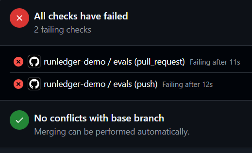
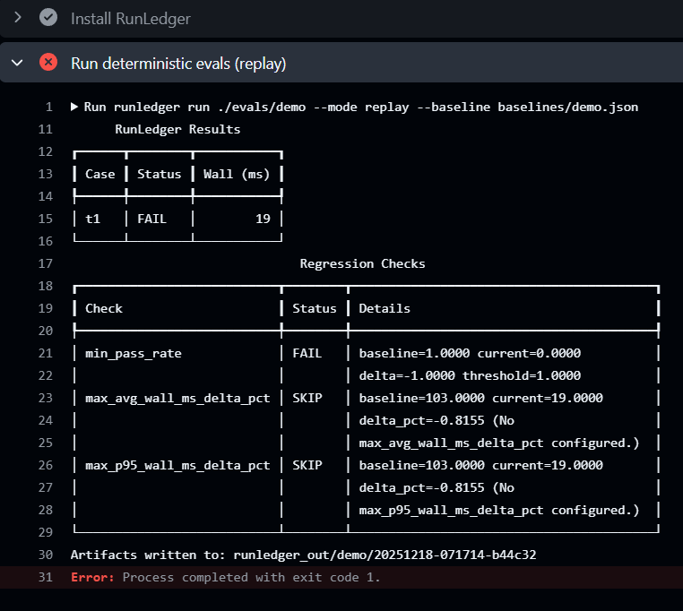

# RunLedger

[](https://github.com/runledger/Runledger/actions/workflows/ci.yml)
[](https://pypi.org/project/runledger/)
[](LICENSE)

Website: https://runledger.io

**CI for tool-using agents.** Deterministic eval suites with record/replay tool calls, hard assertions, budgets, and PR regression gates.

RunLedger is a **CI harness**, not an "eval metrics framework":
- **DeepEval-style tools** help you *score* behavior.
- **RunLedger** helps you *ship safely* by making agent tests deterministic and merge-gated.

---

## Why RunLedger (in one minute)

### The problem

Agents regress silently. Standard unit tests can't catch:

- prompt drift that breaks tool schemas
- hallucinated tool arguments
- latency spikes or budget overruns
- flaky external APIs causing false negatives in CI

### The solution

RunLedger stops regressions by shifting from "vibes-based" evaluation to deterministic contracts:

- **Record & replay:** record tool outputs once; replay them in CI for instant, stable tests.
- **Strict contracts:** enforce tool schemas, calling order, and allowlists.
- **Budget gating:** fail PRs automatically if execution time, steps, or costs exceed defined limits.

### RunLedger vs evaluation frameworks

| Feature | DeepEval / Ragas / TruLens | RunLedger |
| --- | --- | --- |
| Primary goal | Scoring quality ("Is this answer helpful?") | Shipping safely ("Did we break the build?") |
| Tool execution | Often live or mocked manually | Record/replay cassettes (automatic mocking) |
| Pass/fail criteria | LLM-graded scores (0.0 - 1.0) | Hard contracts (schema, budgets, order) |
| Best for | Improving prompt quality | Preventing regressions in production |

Note: you can use both. Use DeepEval to calculate scores, and wrap your agent in RunLedger to ensure it runs deterministically in CI.

---

## Quickstart (5 minutes)

```bash
pipx install runledger
runledger init
runledger run ./evals/demo --mode record
runledger baseline promote --from <RUN_DIR> --to baselines/demo.json
runledger run ./evals/demo --mode replay --baseline baselines/demo.json
```

## What it looks like in a PR

**PR blocked (checks fail):**


**Why it failed (RunLedger output):**


Artifacts are written to `runledger_out/<suite>/<run_id>/`:

- `report.html`, `summary.json`, `junit.xml`, `run.jsonl`

---

## FAQ: Why not just use DeepEval?

DeepEval is excellent for *evaluation metrics* and benchmarking.
RunLedger is focused on *CI determinism for tool-using agents*:

- Record tool calls once -> replay in CI (stable, fast, no flaky external dependencies)
- Merge gates based on hard contracts (schema/tool/budgets), not "LLM-judge vibes"
- Baselines-as-code (diffs + promotions) that fit cleanly into PR workflows

If you already use DeepEval, keep it - RunLedger can be the harness that makes agent tests CI-grade.

---

## When to use RunLedger vs DeepEval

Use **RunLedger** when you need:

- deterministic CI for tool-using agents (web/APIs/DBs)
- hard pass/fail contracts (schema/tool order/budgets)
- baselines + PR regression gates

Use **DeepEval** when you need:

- rich evaluation metrics / model-graded scoring / benchmarking workflows

Use **both** if you want DeepEval scoring inside a deterministic CI harness.

---

## How it works

1. You define a **suite** (`suite.yaml`) and **cases** (`cases/*.yaml`).
2. The runner launches your **agent under test** as a subprocess (any language).
3. The agent requests tools via a **stdio JSON protocol**.
4. The runner either:

   * **records** tool results to a cassette (local/dev), or
   * **replays** tool results from a cassette (CI/deterministic).
5. The agent emits a **final JSON output**.
6. The runner applies **assertions** + **budgets**, compares to a **baseline**, writes artifacts, and exits non-zero on regressions.

---

## Agent-under-test protocol (language-agnostic)

**Transport:** newline-delimited JSON messages over stdin/stdout.

**Hard rule:** agent must write **protocol JSON only to stdout**.
Any human logs must go to **stderr** (stdout must stay parseable).

### Runner -> Agent

`task_start`

```json
{ "type": "task_start", "task_id": "t1", "input": { "...": "..." } }
```

`tool_result`

```json
{ "type": "tool_result", "call_id": "c1", "ok": true, "result": { "...": "..." } }
```

### Agent -> Runner

`tool_call`

```json
{ "type": "tool_call", "name": "search_docs", "call_id": "c1", "args": { "q": "..." } }
```

`final_output` (must be JSON)

```json
{ "type": "final_output", "output": { "category": "billing", "reply": "..." } }
```

Optional:

* `log` (structured debug)
* `task_error` (explicit failure)

---

## Eval suite format

### `evals/<suite>/suite.yaml` (example)

```yaml
suite_name: support-triage
agent_command: ["python", "agent.py"]
mode: replay            # replay | record | live
cases_path: cases
tool_registry:
  - search_docs
  - create_issue

assertions:
  - type: json_schema
    schema_path: schema.json

budgets:
  max_wall_ms: 20000
  max_tool_calls: 10
  max_tool_errors: 0

baseline_path: baselines/support-triage.json
```

### `evals/<suite>/cases/t1.yaml` (example)

```yaml
id: t1
description: "triage a login ticket"
input:
  ticket: "User cannot login"
  context:
    plan: "pro"
cassette: cassettes/t1.jsonl

assertions:
  - type: required_fields
    fields: ["category", "reply"]

budgets:
  max_wall_ms: 5000
```

---

## Record/replay tool calls (cassettes)

### Why record/replay?

Agents often depend on external tools (search, DB, HTTP). Live calls in CI are:

* slow
* flaky
* non-deterministic
* expensive

Instead:

* **record once** (live tools) -> write cassette
* **replay in CI** (deterministic) -> stable and fast

### Cassette format (JSONL example)

Each line is one tool invocation:

```json
{"tool":"search_docs","args":{"q":"reset password"},"ok":true,"result":{"hits":[...]}}
{"tool":"create_issue","args":{"title":"Login issue","priority":"p2"},"ok":true,"result":{"id":"ISSUE-123"}}
```

**Replay matching (MVP):**

* exact match on `tool` + canonicalized `args`
* if not found: the case fails with a clear "cassette mismatch" error

---

## Assertions (deterministic)

MVP assertions:

* `json_schema` (validate final output with JSON Schema)
* `required_fields` (keys exist / basic typing)
* `regex` / `contains` (for specific fields)
* `tool_contract`:

  * must call tool X
  * must not call tool Y
  * X before Y (ordering)

Not default-gating (optional later):

* LLM-judge scoring
* semantic similarity scoring

---

## Budgets (merge gates)

MVP budgets:

* `max_wall_ms`
* `max_tool_calls`
* `max_tool_errors`

Optional budgets when agents report metrics:

* `max_tokens_out`
* `max_cost_usd`

---

## Baselines + regression checks

On each run, you can compare against a baseline and fail CI if:

* success rate drops below threshold
* costs spike beyond allowed delta
* latency p95 increases beyond allowed delta

Typical workflow:

* record cassettes locally
* establish a baseline from a known-good run
* run replay mode on every PR and gate merges on regressions

```bash
runledger baseline promote --from runledger_out/<suite>/<run_id> --to baselines/<suite>.json
runledger run ./evals/<suite> --mode replay --baseline baselines/<suite>.json
```

---

## Output artifacts

A run produces:

* `run.jsonl` -- append-only event log (steps, tool calls/results, outputs)
* `summary.json` -- suite + case metrics, pass/fail, regression summary
* `junit.xml` -- CI-native pass/fail (each case maps to a test)
* `report.html` -- static shareable report (no server required)

These files are intentionally stable so they can be:

* diffed in PRs
* uploaded as CI artifacts
* ingested by a future hosted add-on

---

## GitHub Actions (example)

```yaml
name: agent-evals
on:
  pull_request:

jobs:
  evals:
    runs-on: ubuntu-latest
    steps:
      - uses: actions/checkout@v4

      - name: Run deterministic evals (replay)
        uses: runledger/Runledger@v0.1
        with:
          path: ./evals/demo
          mode: replay

      - name: Upload eval artifacts
        uses: actions/upload-artifact@v4
        with:
          name: agent-eval-artifacts
          path: runledger_out/**
```

---

## Determinism guide (rules of the road)

* Prefer `--mode replay` in CI.
* Ensure agent writes **only JSONL protocol messages** to stdout; logs go to stderr.
* Canonicalize tool call args (stable key ordering, avoid volatile fields).
* Avoid timestamps/randomness in final output; if needed, exclude or normalize before assertions.
* Keep cassettes safe to commit: redact secrets by default.

---

## Docs

- `docs/quickstart.md` -- install + first run
- `docs/assertions.md` -- assertions, tool contracts, budgets
- `docs/baselines.md` -- baselines, diffing, promotion
- `docs/ci.md` -- CI setup with GitHub Actions
- `docs/contracts.md` -- public contracts (YAML, protocol, artifacts)
- `docs/troubleshooting.md` -- common errors and fixes

---

## Roadmap

* `init` templates for Python (OpenAI SDK), LangGraph/LangChain, and Node/TS
* richer budgets (tokens/cost) via optional `task_metrics`
* PR comments bot for regression summaries
* plugin system for custom assertions
* HTML report trace viewer improvements

---

## Commercial Support

RunLedger is MIT-licensed and free to self-host. For teams that want done-for-you implementation or ongoing maintenance, we offer:

- Hardening Sprint (fixed-scope implementation to get deterministic CI running fast)
- Assurance (monthly retainer for cassette and case updates, budget tuning, and incident response)

Contact: [runledger.io/community.html#contact](https://runledger.io/community.html#contact)

---

## Contributing

* Issues and PRs welcome.
* See `CONTRIBUTING.md` for development setup, style, and testing.
* Security issues: see `SECURITY.md`.

---

## License

MIT
